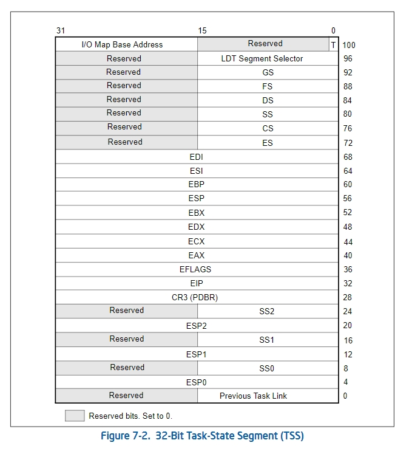
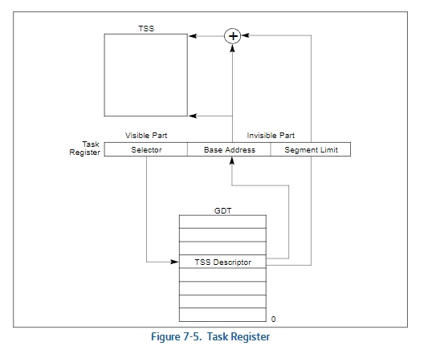

### 内核线程

#### 什么是线程

线程（Thread）是计算机科学中一种程序执行的基本单位，它可以看作是比进程更小的运行单元。一个进程可以包含多个线程，线程之间共享同一个进程的资源，例如内存空间和文件句柄，但每个线程都有自己的寄存器和堆栈。以下是线程的详细介绍：

---

##### **线程的特点**
1. **轻量级**  
   - 相较于进程，线程的创建和销毁开销较小。
   - 线程切换速度快，因为它们共享进程的资源。

2. **资源共享**  
   - 同一进程中的线程共享内存空间、打开的文件等资源，这使得线程之间的通信更加高效。
   - 共享资源也带来了同步和竞争的问题。

3. **独立性**  
   - 每个线程有自己的栈、程序计数器（PC）和寄存器。

---

##### **线程与进程的比较**

| 特性            | 线程                      | 进程                      |
|----------------|-------------------------|-------------------------|
| 调度单位         | 更小，线程是调度的最小单位    | 更大，进程是资源分配的最小单位   |
| 资源共享         | 同一进程的线程共享资源        | 进程之间独立资源            |
| 开销            | 较小（创建、切换、销毁）      | 较大                   |
| 独立性           | 不完全独立                | 独立                   |
| 崩溃影响         | 线程崩溃可能导致进程崩溃      | 一个进程崩溃不影响其他进程      |

---

#### 什么是内核线程

内核线程是由操作系统内核管理和调度的线程，存在于内核空间。它是操作系统中独立执行的基本单位，也是硬件（CPU）直接感知和调度的线程类型。内核线程的创建、销毁以及上下文切换完全由内核负责。

---

#### **内核线程的特点**
1. **内核级支持**  
   - 内核线程由操作系统内核直接管理，线程的创建、销毁、调度和同步均通过系统调用完成。

2. **独立的执行路径**  
   - 每个内核线程都有独立的堆栈和寄存器，但可以共享所在进程的资源，如内存空间、文件句柄等。

3. **真正的并发**  
   - 在多核处理器上，多个内核线程可以并行运行，利用硬件资源实现真正的并发。

4. **线程阻塞与调度**  
   - 如果一个内核线程阻塞（例如等待I/O操作完成），内核可以调度其他线程运行，不会影响整个进程的运行。

---

#### **内核线程与用户线程的比较**

| 特性              | 内核线程                          | 用户线程                          |
|------------------|-------------------------------|-------------------------------|
| 管理者             | 操作系统内核                     | 用户程序                       |
| 调度              | 由内核完成                       | 由用户级线程库完成                 |
| 阻塞管理           | 一个线程阻塞不会影响其他线程          | 一个线程阻塞可能导致整个进程阻塞       |
| 创建与切换开销       | 较大（需要系统调用）               | 较小（无需系统调用）               |
| 性能              | 受限于内核开销，适合多核场景          | 更快的切换，单核性能更优              |
| 并发能力           | 真正的并行（多核支持）              | 伪并行（同一时间只能有一个线程运行）      |

---

### **TSS（Task State Segment）——任务状态段**

#### **定义**
TSS（Task State Segment）是x86架构处理器中一种特殊的数据结构，用于保存任务（Task）运行时的状态信息。它是Intel处理器在硬件层面支持任务切换的核心机制，通过记录任务上下文（如寄存器状态、段选择子等），实现从一个任务切换到另一个任务的快速操作。

---

#### **TSS的作用**
1. **任务切换**  
   - 在任务切换过程中，TSS保存当前任务的状态（如CPU寄存器的内容），并加载新任务的状态，从而完成上下文切换。
   
2. **硬件支持的上下文保存**  
   - TSS提供了硬件级别的任务上下文保存和恢复能力，减轻了软件切换的负担。

3. **特权级切换**  
   - 当从用户态（低特权级）切换到内核态（高特权级）时，TSS提供了内核栈指针等关键信息，确保系统的安全性。

---

#### **TSS的结构**

TSS是一个由CPU管理的段，它是x86架构中段描述符的一种。它存储了任务的完整状态，典型的TSS结构包括以下内容：

| 字段               | 描述                                           |
|-------------------|----------------------------------------------|
| **旧任务链接**       | 保存前一个任务的TSS选择子，用于任务嵌套。                   |
| **ESP0、SS0**       | 用于特权级切换时的栈指针和栈段选择子（从低特权级切换到高特权级）。 |
| **ESP1、SS1**       | 可选的特权级1的栈指针和栈段选择子。                    |
| **ESP2、SS2**       | 可选的特权级2的栈指针和栈段选择子。                    |
| **CR3**           | 保存任务的页目录基地址，用于任务的地址空间切换。           |
| **EIP**           | 保存任务的指令指针（程序计数器）。                      |
| **EFLAGS**        | 保存任务的标志寄存器。                               |
| **通用寄存器**        | 包括EAX、ECX、EDX等寄存器的值。                   |
| **段选择子**         | 保存任务的段寄存器内容（CS、DS、ES等）。              |
| **I/O许可位图基址**   | 指向任务的I/O许可位图，用于控制任务的I/O访问权限。        |

---

#### **TSS的使用场景**
1. **特权级切换（主要用途）**  
   - TSS中的`ESP0`和`SS0`字段用于从用户态切换到内核态时加载内核栈。

2. **任务切换（较少使用）**  
   - 早期操作系统（如MS-DOS）使用TSS进行任务切换，但现代操作系统更倾向于使用软件实现任务切换。

3. **安全管理**  
   - TSS的I/O许可位图用于限制用户程序对I/O端口的访问。

---

#### **TSS在现代操作系统中的作用**
1. **有限使用**  
   - 虽然TSS提供了硬件支持的任务切换，但现代操作系统（如Linux、Windows）更倾向于使用软件调度和切换，以获得更大的灵活性和性能。
   
2. **专注于特权级切换**  
   - 在现代系统中，TSS主要用于切换到内核栈，以支持从用户态到内核态的安全切换。

3. **I/O访问控制**  
   - TSS中的I/O许可位图仍然被使用，用于限制任务对硬件资源的访问。

#### TR(Task Register)

任务寄存器保存了16位段选择子和当前任务TSS的整个段描述符。在处理器上电或复位时，段选择符和基地址被设置为默认值0；限长被设置为FFFFH。

+ `LTR`: 指令将一个段选择符（源操作数）加载到任务寄存器中，该段选择符指向GDT中的TSS描述符。然后，它将任务寄存器的不可见部分加载为来自TSS描述符的信息（LTR是一个特权指令，只能在CPL为0时执行）。

+ `STR`: 指令将任务寄存器的可见部分存储在通用寄存器或内存中。这个指令可以由任何特权级别的运行代码执行，以标识当前运行的任务。

